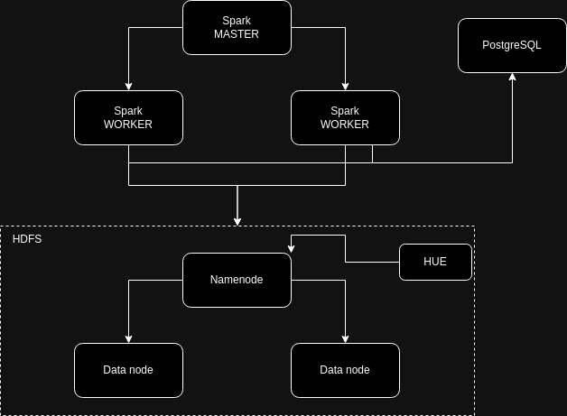

# Specifikacija projekta

Ratko Ružičić E2 102/2023

## Domen

Domen ovog projekta jesu logovi, konkretno posmatraćemo logove jednog veb servera koji servira sadržaj korisnicima koji dolaze sa raznih IP adresa. 

## Motivacija

Živimo u vremenu gde skoro svaka naša interakcija na telefonima i/ili računarima u nekom trenutku kontaktira eksterne servise hostovane na internetu. Ovakvi servisi su često hostovani uz pomoć veb servera poput "nginx" a kako ovakvi veb serveri često beleže svaki pristup istom kao vlasnik jednog takvog servisa možemo relativno lako izvući podatke ključne za poslovanje. Pored biznis podataka možemo izdvojiti podatke u slučaju napada na servis ili bilo koje druge tehničke smetnje.  

## Ciljevi

Sagledavanje ključnih pokazatelja učinka(KPI) koji nam govore o popularnosti same platforme koja je hostovana na veb serveru čije podatke obrađujemo kao i izdvajanje parametara bitnih u slučaju katastrofe(Disaster Recovery). Tokom paketne obrade akcenat bi trebao da bude na KPI dok tokom obrade podataka u realnom vremenu stavljamo akcenat na "disaster recovery".

## Skup podataka

https://www.kaggle.com/datasets/eliasdabbas/web-server-access-logs

**skup podataka je zapravo 3.5GB veličina fajla za preuzimanje je 280MB zato što je fajl zipovan*

## Pitanja na koja bi analiza trebala da odgovori

### Paketna obrada

1. Sa kojih IP adresa dobijamo najviše zahteva? 
2. U kom dobu dana imamo najviše zahteva?
3. Koji su najčešće HTTP metode koje korisnici koriste?
4. Koje HTTP putanje prihvataju najviše saobraćaja? 
    *ovde bih želeo da vidim stablo najčešćih putanja npr. '/a' prihvata 50% saobraćaja od toga '/a/b' prihvata 5% a '/a/c' prihvata ostalih 45%*
5. Raspodela operativnih sistema koje korisnici najviše koriste?
6. Koji veb pretraživači su najčešće korišćeni?
7. Koji su najčešći kodovi HTTP odgovora?
8. Sa kojih HTTP putanja dolazi najviše zahteva(HTTP referer)?
9. Koje HTTP putanje su do sada imale najviše podataka poslatih korisnicima?
10. Koja IP adresa je potraživala najviše podataka do sad?
11. BONUS: "reverse DNS lookup" nad IP adresama i izdvanjanje najčešćih domena ili pronalaženje najčešćih lokacija korisnika na osnovu IP adrese

### Obrada podataka u realnom vremenu

1. Sa kojih IP adresa smo dobili najviše zahteva u proteklih sat vremena?
2. Koje IP adrese su potraživale najviše podataka u poslednjih sat vremena?
3. Koliko je ukupno bajtova podataka naš veb server poslao u proteklih sat vremena?
4. Koji su najčešći kodovi HTTP odgovora u poslednjih sat vremena?
5. Na kojoj HTTP putanji smo dobili najviše zahteva u proteklih sat vremena?

## Dijagram arhitekture

